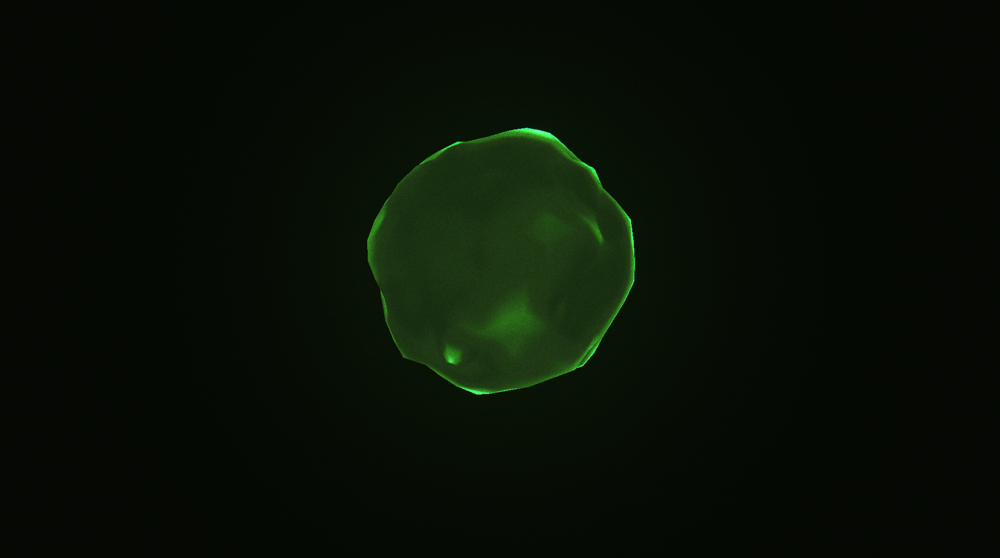

# Phosphor

A browser-based, full-screen dark environment containing a single
luminous entity that cycles through six states under developer control.
No microphone, no AI API, no camera — amplitude is simulated behind a
clean source interface. A portfolio piece and technical proof: React 19,
TypeScript (strict), Vite, three.js via React Three Fiber, custom GLSL.



Every colour on screen is a pixel value sampled from a curated reference
set — bioluminescent fungi, green aurora, Blade Runner 2049's grey-green
interiors — extracted and documented in [docs/01-research.md](docs/01-research.md).
Design and state model: [docs/02-plan.md](docs/02-plan.md). What was
chosen, why, and measured numbers: [docs/03-decisions.md](docs/03-decisions.md).
A capture of the full sequence: [docs/media/sequence.webm](docs/media/sequence.webm).

## Run

```
npm ci
npm run dev
```

Then open the printed local URL. (`npm test` runs the state-machine key
sweep: all 30 ordered state pairs, interrupts included.)

## Keyboard

| Key | Action |
|---|---|
| `1`–`5` | enter DORMANT · AWAKE · LISTENING · THINKING · SPEAKING |
| `6` | RETURN — the authored dissolve back to DORMANT |
| `space` | advance the canonical sequence |
| `d` | toggle diagnostics (state, fps, amplitude, tier) — off by default |
| `↑` / `↓` | switch amplitude to the manual source and nudge its level |

Any state may be requested at any moment, including mid-transition; the
machine re-aims from the live interpolated values, so mashing keys never
pops.

## State model

Six states, each a vector of shader-uniform targets; transitions between
them are *derived* from one grammar (curve family from the emission
direction, duration from vector distance, staggered by behaviour → light
→ structure groups), except two authored pieces:

- **T1 wake** — gather, ignite with overshoot, settle: arrival, not a
  fade-in.
- **T5 return** — release, sink with edge erosion, bank: energy leaves
  before form; explicitly not the wake reversed.

DORMANT is not nothing: an olive-tinted ember (the palette's one accent,
`#324816`) with a faint ground halo, swelling on a noise gate roughly
every 20 seconds. THINKING turns inward — less outward motion, more
internal density — rather than speeding up. Breathing is asymmetric
(inhale 35% / exhale 55% / rest 10%, period wobbling on a slow noise) and
nothing in the piece loops on a lockable period.

`prefers-reduced-motion` is honoured by reducing: breath and drift are
scaled down and the SPEAKING displacement flare is dropped; the piece
never freezes.

## Where real audio plugs in

The renderer never touches an audio source. It reads a smoothed envelope
from an `AmplitudeBus`; sources implement four methods
([src/amplitude/AmplitudeSource.ts](src/amplitude/AmplitudeSource.ts)):

```ts
interface AmplitudeSource {
  readonly id: string;
  start(): void;
  stop(): void;
  read(nowMs: number): number; // instantaneous 0..1, unsmoothed
  dispose(): void;
}
```

Two simulated sources ship: a seeded synthetic speech envelope with
phrase/syllable/articulation structure, and a manual arrow-key level. A
microphone (`AnalyserNode` RMS in `read()`) or a TTS stream (a
`MediaElementAudioSourceNode` tap) drops in without touching the
renderer — attack/release smoothing already lives on the bus side.

## Quality tiers

The default (high) tier is what you are meant to judge: full DPR,
order-6 icosphere, 3-octave displacement, true displaced normals,
mip-blurred bloom. `?tier=low` models the Raspberry Pi-class deployment
target: reduced render scale, order-4 sphere, 2 octaves, sphere-normal
shading, bloom replaced by a shader-side halo. Its cost is visible live
in the diagnostics readout; measured numbers are in
[docs/03-decisions.md](docs/03-decisions.md).
